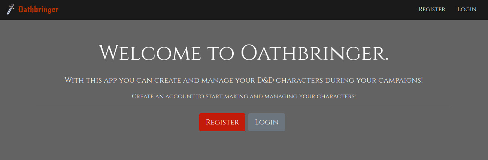
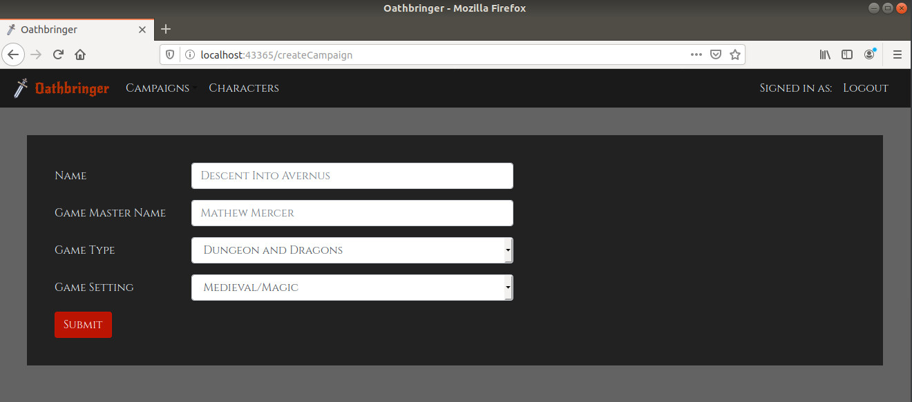

(This is still in development and will probably have lots of errors since I'm using it to learn both React and Clojure/Datomic)

The creation of this app came from needing something to record notes on each session of a RPG campaign. 
I wanted something with more logic and organization than simply writing on a doc file. The idea is to be able to create 
e.g. npcs and towns, then later on, reference them in the notes(I know that there probably are other sites that can do this, 
but again, I'm using this to learn new technologies).

Another necessity that I wanted to implement is tracking the carrying capacity of the character either by size or weight.

Stack:

The front-end is written in React with Redux for state management and the back-end is in Clojure(Ring + Compojure + Httpkit)
and a Datomic database. Why Clojure and Datomic? Because I think they're cool and powerful and I wanted to learn how to use them :P.

Creating a campaign:

